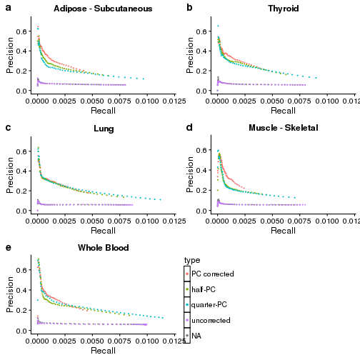

This will re-generate precision and recall plots in graphical lasso networks using canonical pathway databases and includes RIN, GC bias and exonic rate as covariates


```r
source("/work-zfs/abattle4/parsana/networks_correction/src/config")
```

```
## Loading required package: SummarizedExperiment
```

```
## Loading required package: methods
```

```
## Loading required package: GenomicRanges
```

```
## Loading required package: stats4
```

```
## Loading required package: BiocGenerics
```

```
## Loading required package: parallel
```

```
## 
## Attaching package: 'BiocGenerics'
```

```
## The following objects are masked from 'package:parallel':
## 
##     clusterApply, clusterApplyLB, clusterCall, clusterEvalQ,
##     clusterExport, clusterMap, parApply, parCapply, parLapply,
##     parLapplyLB, parRapply, parSapply, parSapplyLB
```

```
## The following objects are masked from 'package:stats':
## 
##     IQR, mad, sd, var, xtabs
```

```
## The following objects are masked from 'package:base':
## 
##     anyDuplicated, append, as.data.frame, cbind, colMeans,
##     colnames, colSums, do.call, duplicated, eval, evalq, Filter,
##     Find, get, grep, grepl, intersect, is.unsorted, lapply,
##     lengths, Map, mapply, match, mget, order, paste, pmax,
##     pmax.int, pmin, pmin.int, Position, rank, rbind, Reduce,
##     rowMeans, rownames, rowSums, sapply, setdiff, sort, table,
##     tapply, union, unique, unsplit, which, which.max, which.min
```

```
## Loading required package: S4Vectors
```

```
## Warning: replacing previous import 'stats::sd' by 'BiocGenerics::sd' when
## loading 'S4Vectors'
```

```
## Warning: replacing previous import 'stats::var' by 'BiocGenerics::var' when
## loading 'S4Vectors'
```

```
## 
## Attaching package: 'S4Vectors'
```

```
## The following object is masked from 'package:base':
## 
##     expand.grid
```

```
## Loading required package: IRanges
```

```
## Warning: replacing previous import 'stats::sd' by 'BiocGenerics::sd' when
## loading 'IRanges'
```

```
## Warning: replacing previous import 'stats::var' by 'BiocGenerics::var' when
## loading 'IRanges'
```

```
## Loading required package: GenomeInfoDb
```

```
## Loading required package: Biobase
```

```
## Welcome to Bioconductor
## 
##     Vignettes contain introductory material; view with
##     'browseVignettes()'. To cite Bioconductor, see
##     'citation("Biobase")', and for packages 'citation("pkgname")'.
```

```
## Setting options('download.file.method.GEOquery'='auto')
```

```
## Setting options('GEOquery.inmemory.gpl'=FALSE)
```

```
## Loading required package: dynamicTreeCut
```

```
## Loading required package: fastcluster
```

```
## 
## Attaching package: 'fastcluster'
```

```
## The following object is masked from 'package:stats':
## 
##     hclust
```

```
## 
```

```
## ==========================================================================
## *
## *  Package WGCNA 1.61 loaded.
## *
## *    Important note: It appears that your system supports multi-threading,
## *    but it is not enabled within WGCNA in R. 
## *    To allow multi-threading within WGCNA with all available cores, use 
## *
## *          allowWGCNAThreads()
## *
## *    within R. Use disableWGCNAThreads() to disable threading if necessary.
## *    Alternatively, set the following environment variable on your system:
## *
## *          ALLOW_WGCNA_THREADS=<number_of_processors>
## *
## *    for example 
## *
## *          ALLOW_WGCNA_THREADS=24
## *
## *    To set the environment variable in linux bash shell, type 
## *
## *           export ALLOW_WGCNA_THREADS=24
## *
## *     before running R. Other operating systems or shells will
## *     have a similar command to achieve the same aim.
## *
## ==========================================================================
```

```
## 
## Attaching package: 'WGCNA'
```

```
## The following object is masked from 'package:IRanges':
## 
##     cor
```

```
## The following object is masked from 'package:S4Vectors':
## 
##     cor
```

```
## The following object is masked from 'package:stats':
## 
##     cor
```

```
## Loading required package: BBmisc
```

```
## 
## Attaching package: 'BBmisc'
```

```
## The following object is masked from 'package:IRanges':
## 
##     collapse
```

```
## The following object is masked from 'package:BiocGenerics':
## 
##     normalize
```

```
## Sourcing configuration file: '/home-3/pparsan1@jhu.edu/R/x86_64-pc-linux-gnu-library/3.3/BatchJobs/etc/BatchJobs_global_config.R'
```

```
## BatchJobs configuration:
##   cluster functions: Interactive
##   mail.from: 
##   mail.to: 
##   mail.start: none
##   mail.done: none
##   mail.error: none
##   default.resources: 
##   debug: FALSE
##   raise.warnings: FALSE
##   staged.queries: TRUE
##   max.concurrent.jobs: Inf
##   fs.timeout: NA
```

```
## Warning in dir.create(netMain): '/work-zfs/abattle4/parsana/
## networks_correction/networks' already exists
```

```
## Warning in dir.create(pc): '/work-zfs/abattle4/parsana/networks_correction/
## networks/pc_corrected' already exists
```

```
## Warning in dir.create(pcglasso): '/work-zfs/abattle4/parsana/
## networks_correction/networks/pc_corrected/glasso' already exists
```

```
## Warning in dir.create(rin): '/work-zfs/abattle4/parsana/
## networks_correction/networks/rin' already exists
```

```
## Warning in dir.create(ringlasso): '/work-zfs/abattle4/parsana/
## networks_correction/networks/rin/glasso' already exists
```

```
## Warning in dir.create(raw): '/work-zfs/abattle4/parsana/
## networks_correction/networks/raw' already exists
```

```
## Warning in dir.create(rawglasso): '/work-zfs/abattle4/parsana/
## networks_correction/networks/raw/glasso' already exists
```

```
## Warning in dir.create(half.pc): '/work-zfs/abattle4/parsana/
## networks_correction/networks/half_pc_corrected' already exists
```

```
## Warning in dir.create(half.pcglasso): '/work-zfs/abattle4/parsana/
## networks_correction/networks/half_pc_corrected/glasso' already exists
```

```
## Warning in dir.create(quarter.pc): '/work-zfs/abattle4/parsana/
## networks_correction/networks/quarter_pc_corrected' already exists
```

```
## Warning in dir.create(quarter.pcglasso): '/work-zfs/abattle4/parsana/
## networks_correction/networks/quarter_pc_corrected/glasso' already exists
```

```
## Warning in dir.create(exonic): '/work-zfs/abattle4/parsana/
## networks_correction/networks/exonic' already exists
```

```
## Warning in dir.create(exonic.glasso): '/work-zfs/abattle4/parsana/
## networks_correction/networks/exonic/glasso' already exists
```

```
## Warning in dir.create(expeff): '/work-zfs/abattle4/parsana/
## networks_correction/networks/expeff' already exists
```

```
## Warning in dir.create(expeff.glasso): '/work-zfs/abattle4/parsana/
## networks_correction/networks/expeff/glasso' already exists
```

```
## Warning in dir.create(gc): '/work-zfs/abattle4/parsana/networks_correction/
## networks/gc' already exists
```

```
## Warning in dir.create(gcglasso): '/work-zfs/abattle4/parsana/
## networks_correction/networks/gc/glasso' already exists
```

```
## Warning in dir.create(multi3): '/work-zfs/abattle4/parsana/
## networks_correction/networks/multi3' already exists
```

```
## Warning in dir.create(multi3glasso): '/work-zfs/abattle4/parsana/
## networks_correction/networks/multi3/glasso' already exists
```

```
## Warning in dir.create(multicorr): '/work-zfs/abattle4/parsana/
## networks_correction/networks/multicorr' already exists
```

```
## Warning in dir.create(multicorrglasso): '/work-zfs/abattle4/parsana/
## networks_correction/networks/multicorr/glasso' already exists
```

```r
library(cowplot)
```

```
## 
## Attaching package: 'cowplot'
```

```
## The following object is masked from 'package:ggplot2':
## 
##     ggsave
```

```r
## Read files
theme_set(theme_cowplot(font_size=12)) # reduce default font size

plot.thyroid <- read.csv("/work-zfs/abattle4/parsana/networks_correction/publication_figures/fig3/pr_table_thyroid.csv", row.names = 1, stringsAsFactors = F)
plot.thyroid <- plot.thyroid[-which(plot.thyroid$type %in% c("RIN","expeff", "exonic rate", "gene GC%", "multicorr")),]
plot.thyroid$type <- factor(plot.thyroid$type, levels = c("PC corrected","half-PC","quarter-PC", "gene GC%", "uncorrected"))
plot.thyroid <- ggplot(plot.thyroid, aes(x = recall, y = precision, colour = type)) + geom_point(size = 0.3) + 
  xlab("Recall") + ylab("Precision")+ggtitle("Thyroid")


plot.muscle <- read.csv("/work-zfs/abattle4/parsana/networks_correction/publication_figures/fig3/pr_table_muscle.csv", row.names = 1, stringsAsFactors = F)
plot.muscle <- plot.muscle[-which(plot.muscle$type %in% c("RIN","expeff", "exonic rate", "gene GC%", "multicorr")),]
plot.muscle$type <- factor(plot.muscle$type, levels = c("PC corrected","half-PC","quarter-PC", "gene GC%", "uncorrected"))
plot.muscle <- ggplot(plot.muscle, aes(x = recall, y = precision, colour = type)) + geom_point(size = 0.3) + 
  xlab("Recall") + ylab("Precision")+ggtitle("Muscle - Skeletal")

plot.lung <- read.csv("/work-zfs/abattle4/parsana/networks_correction/publication_figures/fig3/pr_table_lung.csv", , row.names = 1, stringsAsFactors = F)
plot.lung <- plot.lung[-which(plot.lung$type %in% c("RIN","expeff", "exonic rate", "gene GC%", "multicorr")),]
plot.lung$type <- factor(plot.lung$type, levels = c("PC corrected","half-PC","quarter-PC", "gene GC%", "uncorrected"))
plot.lung <- ggplot(plot.lung, aes(x = recall, y = precision, colour = type)) + geom_point(size = 0.3) + 
  xlab("Recall") + ylab("Precision")+ggtitle("Lung")

plot.blood <- read.csv("/work-zfs/abattle4/parsana/networks_correction/publication_figures/fig3/pr_table_blood.csv", , row.names = 1, stringsAsFactors = F)
plot.blood <- plot.blood[-which(plot.blood$type %in% c("RIN","expeff", "exonic rate", "gene GC%", "multicorr")),]
plot.blood$type <- factor(plot.blood$type, levels = c("PC corrected","half-PC","quarter-PC", "gene GC%", "uncorrected"))
plot.blood <- ggplot(plot.blood, aes(x = recall, y = precision, colour = type)) + geom_point(size = 0.3) + 
  xlab("Recall") + ylab("Precision")+ggtitle("Whole Blood")

plot.sub <- read.csv("/work-zfs/abattle4/parsana/networks_correction/publication_figures/fig3/pr_table_sub.csv", row.names = 1, stringsAsFactors = F)
plot.sub <- plot.sub[-which(plot.sub$type %in% c("RIN","expeff", "exonic rate", "gene GC%", "multicorr")),]
plot.sub$type <- factor(plot.sub$type, levels = c("PC corrected","half-PC","quarter-PC", "gene GC%", "uncorrected"))
plot.sub <- ggplot(plot.sub, aes(x = recall, y = precision, colour = type)) + geom_point(size = 0.3) + 
  xlab("Recall") + ylab("Precision")+ggtitle("Adipose - Subcutaneous")

legend <- get_legend(plot.lung +
  theme(legend.key = element_rect(color = "black", linetype = "solid", size = 0.5),
  legend.key.size = unit(0.3, "cm"), legend.key.height=unit(1.5,"line")) + 
  guides(colour = guide_legend(override.aes = list(size= 1))))
```

```
## Warning: Removed 13 rows containing missing values (geom_point).
```

```r
plot_grid(plot.sub + xlim(0,0.012) + ylim(0, 0.71) + theme(legend.position="none"),
  plot.thyroid + xlim(0,0.012) + ylim(0, 0.71) +  theme(legend.position="none"),
  plot.lung + xlim(0,0.012) + ylim(0, 0.71) + theme(legend.position="none"),
  plot.muscle + xlim(0,0.012) + ylim(0, 0.71) + theme(legend.position="none"),
  plot.blood + xlim(0,0.012) + ylim(0, 0.71) + theme(legend.position="none"),
  legend,
           labels = c("a", "b", "c", "d", "e", ""),
           hjust = -1,
           nrow = 3
           )
```

```
## Warning: Removed 10 rows containing missing values (geom_point).
```

```
## Warning: Removed 11 rows containing missing values (geom_point).
```

```
## Warning: Removed 13 rows containing missing values (geom_point).
```

```
## Warning: Removed 10 rows containing missing values (geom_point).

## Warning: Removed 10 rows containing missing values (geom_point).
```


